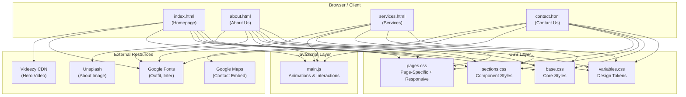
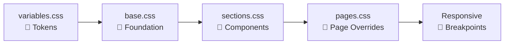
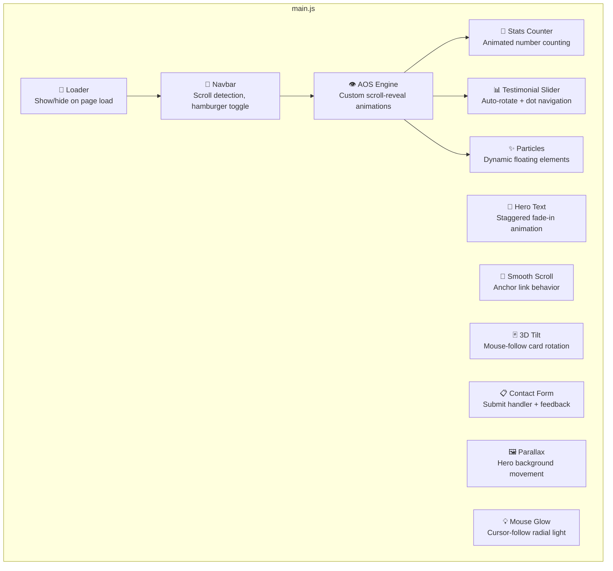
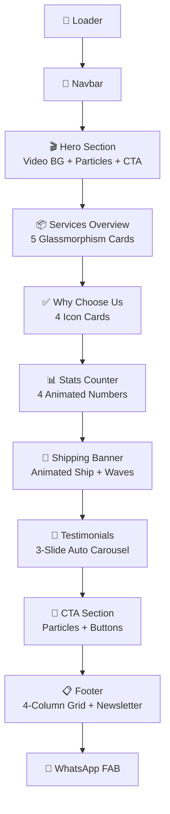
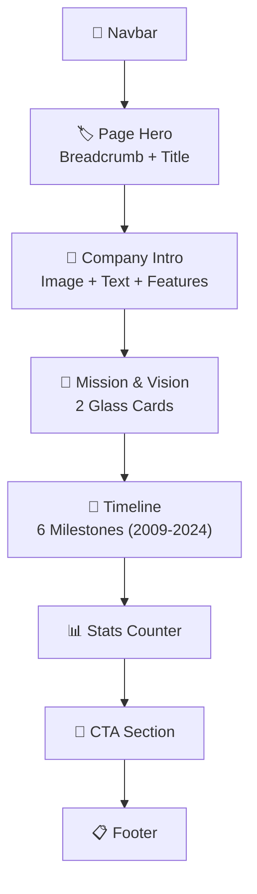
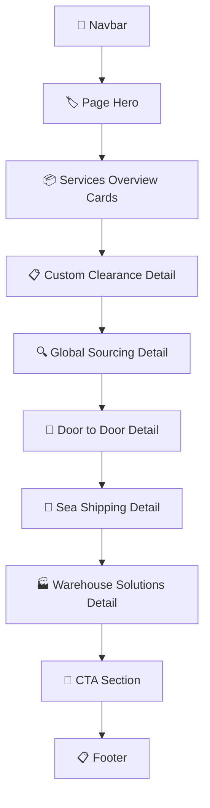
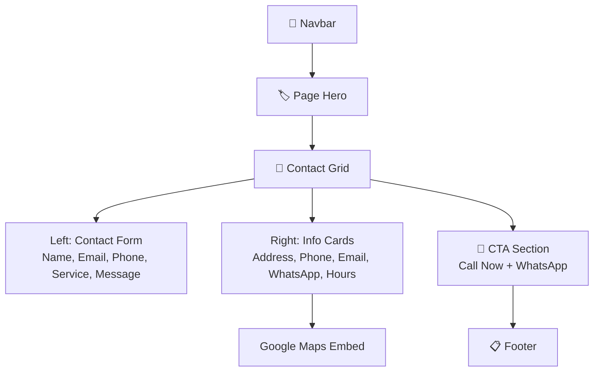
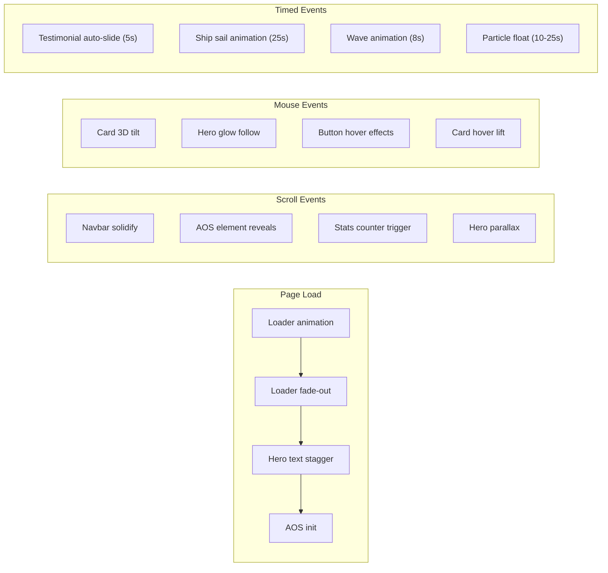

# 🏗️ Saleem Shipping — Website Architecture Plan

---

## 1. Project Overview

| Item | Detail |
|------|--------|
| **Project** | Saleem Shipping — International Logistics Website |
| **Type** | Static multi-page corporate website |
| **Tech Stack** | HTML5, CSS3, Vanilla JavaScript |
| **Pages** | Home, About Us, Services, Contact Us |
| **Design Style** | Premium cinematic enterprise SaaS UI/UX |
| **Target** | International B2B shipping & logistics clients |

---

## 2. Directory Structure

```
e:\saleem shipping\
│
├── index.html                 # Homepage (primary landing page)
├── about.html                 # About Us page
├── services.html              # Services page
├── contact.html               # Contact Us page
│
├── css/
│   ├── variables.css          # Design tokens & CSS custom properties
│   ├── base.css               # Reset, typography, loader, navbar, hero, particles
│   ├── sections.css           # Homepage sections, footer, WhatsApp button
│   └── pages.css              # Inner page styles, responsive breakpoints
│
├── js/
│   └── main.js                # All JavaScript: animations, interactions, logic
│
└── assets/                    # Images, icons, media (future use)
```

---

## 3. High-Level Architecture



---

## 4. CSS Architecture

### 4.1 Design Token System — [variables.css](file:///e:/saleem%20shipping/css/variables.css)

All visual constants are centralized as CSS custom properties for consistency:

| Category | Tokens |
|----------|--------|
| **Colors** | `--navy`, `--navy-light`, `--navy-mid`, `--white`, `--orange`, `--orange-glow`, `--orange-dark` |
| **Glass Effects** | `--glass-bg`, `--glass-border`, `--glass-bg-light` |
| **Shadows** | `--shadow-sm`, `--shadow-md`, `--shadow-lg`, `--shadow-glow` |
| **Border Radius** | `--radius-sm` (8px), `--radius-md` (16px), `--radius-lg` (24px) |
| **Transitions** | `--transition` (0.4s cubic-bezier), `--transition-fast` (0.2s ease) |
| **Typography** | `--font-heading` (Outfit), `--font-body` (Inter) |
| **Layout** | `--container` (1280px) |

### 4.2 Style Layer Hierarchy



| File | Responsibility |
|------|---------------|
| **variables.css** | Color palette, spacing, typography, shadows, transitions |
| **base.css** | Reset, typography scale, loader, navbar, hero section, particles, buttons |
| **sections.css** | Services grid, why-choose cards, stats, shipping banner, testimonials, CTA, footer, WhatsApp |
| **pages.css** | Page hero banner, about page, services detail, contact form, timeline, responsive breakpoints |

### 4.3 Responsive Breakpoints

| Breakpoint | Target |
|------------|--------|
| `≤ 1024px` | Tablets — grids collapse to single column |
| `≤ 768px` | Mobile — hamburger nav, adjusted typography, simplified layouts |
| `≤ 480px` | Small mobile — stacked buttons, single-column everything |

---

## 5. JavaScript Architecture

### [main.js](file:///e:/saleem%20shipping/js/main.js) — Module Breakdown



### 5.1 Feature Details

| Feature | Trigger | Behavior |
|---------|---------|----------|
| **Loader** | `window.load` | Shows animated ship + progress bar → fades out after 2.2s |
| **Navbar** | `scroll` event | Adds `.scrolled` class at 50px → glass blur + solid background |
| **Hamburger** | `click` | Toggles `.active` on nav-links for mobile slide-in menu |
| **AOS (Custom)** | `IntersectionObserver` | Detects elements with `data-aos` attr → applies fade/slide/zoom transitions |
| **Stats Counter** | `IntersectionObserver` | Counts from 0 to target value with eased animation over 2s |
| **Testimonial Slider** | `setInterval` (5s) | Auto-advances slides, dot click for manual control |
| **Particles** | DOM creation | Generates random floating particles in hero and CTA sections |
| **Hero Text** | `setTimeout` | Staggered reveal of hero content children after loader |
| **3D Tilt** | `mousemove` | Service cards rotate based on cursor position (perspective 800px) |
| **Contact Form** | `submit` | Prevents default, shows send animation, resets after 2.5s |
| **Parallax** | `scroll` | Hero background translates at 0.3× scroll speed |
| **Mouse Glow** | `mousemove` | Radial gradient follows cursor on hero section |

### 5.2 Custom AOS Animation Types

| `data-aos` Value | Transform Applied |
|-------------------|-------------------|
| `fade-up` | `translateY(40px)` → `none` |
| `fade-down` | `translateY(-40px)` → `none` |
| `fade-left` | `translateX(40px)` → `none` |
| `fade-right` | `translateX(-40px)` → `none` |
| `zoom-in` | `scale(0.9)` → `none` |
| `flip-up` | `perspective(500px) rotateX(10deg)` → `none` |

> [!NOTE]
> The AOS system is custom-built using `IntersectionObserver` — no external library dependency. Supports `data-aos-delay` for staggered animations.

---

## 6. Page Architecture

### 6.1 Homepage — [index.html](file:///e:/saleem%20shipping/index.html)



### 6.2 About Us — [about.html](file:///e:/saleem%20shipping/about.html)



### 6.3 Services — [services.html](file:///e:/saleem%20shipping/services.html)



> [!TIP]
> Service detail sections use alternating layout (image left/right) via CSS `direction: rtl` on even children for visual variety.

### 6.4 Contact Us — [contact.html](file:///e:/saleem%20shipping/contact.html)



---

## 7. Shared Components

These elements are reused across all 4 pages:

| Component | Description |
|-----------|-------------|
| **Loader** | Animated ship + progress bar + brand name |
| **Navbar** | Logo + 4 nav links + Get Quote CTA + hamburger (mobile) |
| **Footer** | 4-column grid: brand, quick links, services, newsletter |
| **WhatsApp FAB** | Fixed bottom-right floating action button |
| **CTA Section** | "Ready to Ship?" banner with two action buttons |
| **Particles** | Dynamically generated floating dots via JS |

---

## 8. Animation & Interaction Map



---

## 9. Performance Considerations

| Area | Approach |
|------|----------|
| **No external JS libs** | Custom AOS, counter, slider — zero dependencies |
| **CSS-first animations** | Keyframes for continuous animations (waves, particles, ship) |
| **IntersectionObserver** | Efficient scroll detection vs scroll event listeners |
| **Lazy loading** | Google Maps iframe uses `loading="lazy"` |
| **Font loading** | `display=swap` on Google Fonts prevents FOIT |
| **Video optimization** | External CDN for hero video, `muted` + `playsinline` for autoplay |
| **Minimal DOM** | Particles generated only in visible containers |

---

## 10. External Dependencies

| Resource | Source | Used In |
|----------|--------|---------|
| **Google Fonts** | `fonts.googleapis.com` | All pages (Outfit, Inter) |
| **Hero Video** | `static.videezy.com` | Homepage hero background |
| **About Image** | `images.unsplash.com` | About page intro section |
| **Google Maps** | `google.com/maps/embed` | Contact page map |
| **WhatsApp API** | `wa.me` link | WhatsApp floating button |

> [!IMPORTANT]
> All external resources are loaded via CDN. For production, consider self-hosting fonts and replacing the stock video/image with branded assets.

---

## 11. Color & Design System Visual

```
┌─────────────────────────────────────────────────────┐
│  COLOR PALETTE                                       │
├──────────────┬──────────────────────────────────────┤
│  ██████████  │  #0a1628  Dark Navy (Primary BG)     │
│  ██████████  │  #132244  Navy Light (Alt BG)        │
│  ██████████  │  #1a2d5a  Navy Mid (Accents)         │
│  ██████████  │  #ff6b2b  Orange (Primary Accent)    │
│  ██████████  │  #ff8c4b  Orange Glow (Hover)        │
│  ██████████  │  #e55a1b  Orange Dark (Pressed)      │
│  ██████████  │  #ffffff  White (Text)               │
├──────────────┴──────────────────────────────────────┤
│  GLASSMORPHISM                                       │
│  Background: rgba(255,255,255, 0.06)                │
│  Border: rgba(255,255,255, 0.12)                    │
│  Backdrop-filter: blur(10px-20px)                   │
├─────────────────────────────────────────────────────┤
│  TYPOGRAPHY                                          │
│  Headings: Outfit (400-900)                         │
│  Body: Inter (300-700)                              │
│  Scale: clamp() fluid sizing                        │
└─────────────────────────────────────────────────────┘
```

---

## 12. Future Enhancement Opportunities

| Enhancement | Description |
|-------------|-------------|
| 🔍 **Shipment Tracker** | Real-time tracking form with API integration |
| 📧 **Form Backend** | Connect contact form to EmailJS, Formspree, or custom API |
| 🌐 **i18n** | Multi-language support (Arabic, Hindi, etc.) |
| 📱 **PWA** | Service worker + manifest for offline capability |
| 📊 **Analytics** | Google Analytics / Tag Manager integration |
| 🖼️ **Custom Assets** | Replace stock video/images with branded photography |
| ⚡ **GSAP Upgrade** | Add GSAP ScrollTrigger for more cinematic scroll animations |
| 🗄️ **CMS** | Headless CMS for testimonials, blog, and dynamic content |
